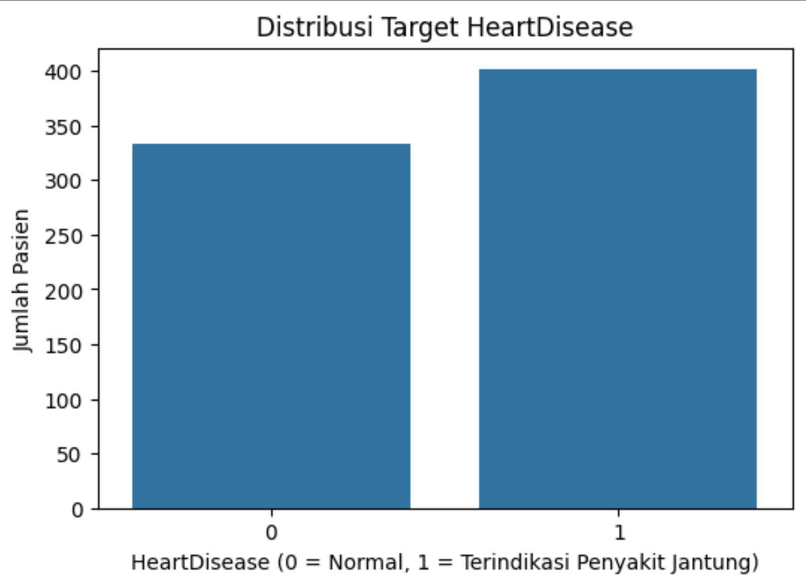
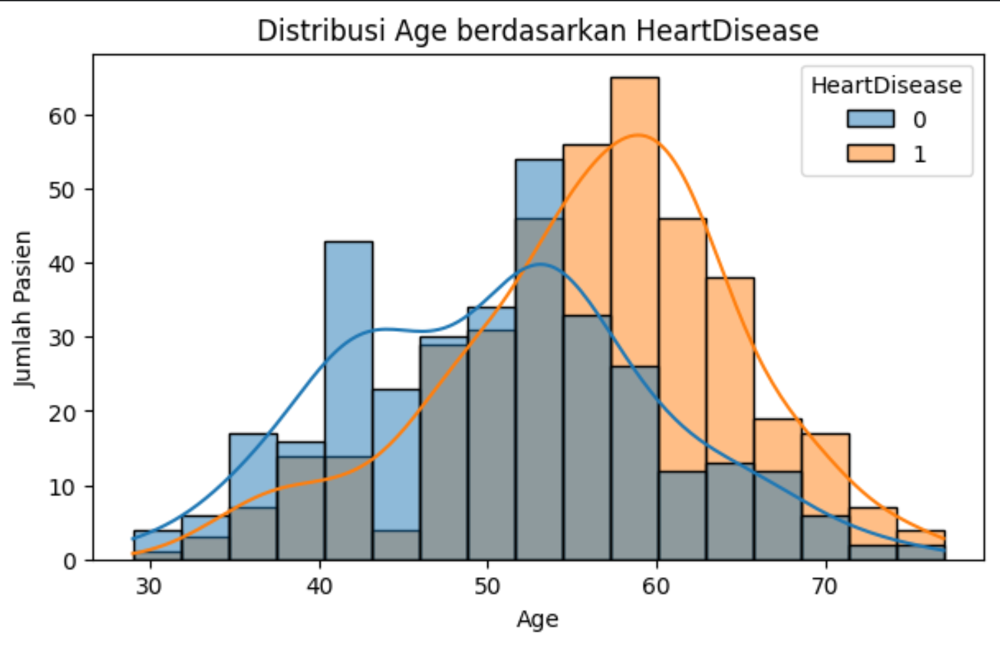
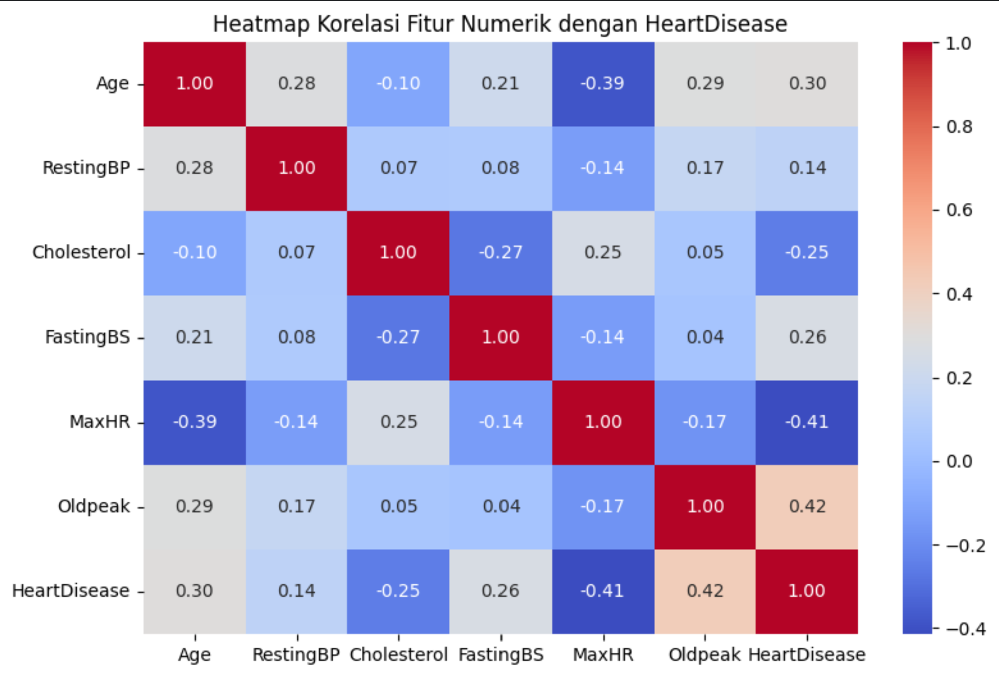
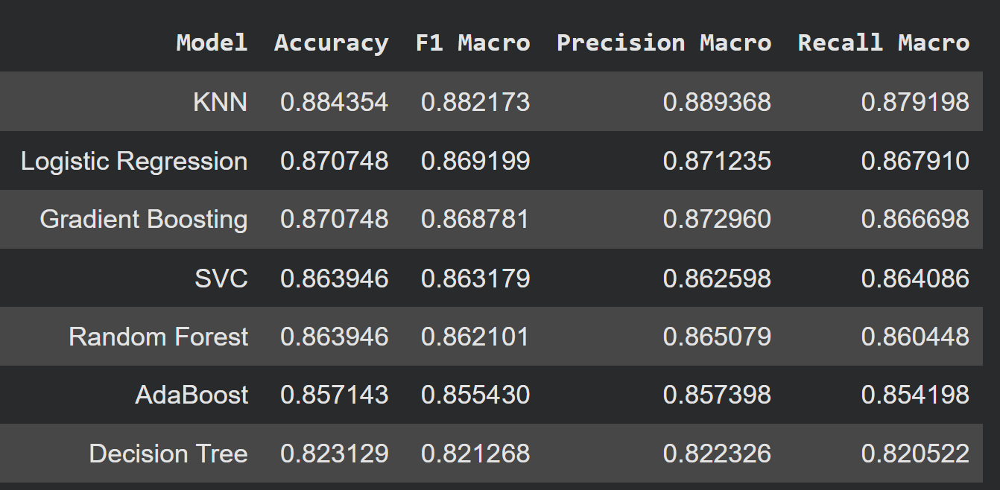
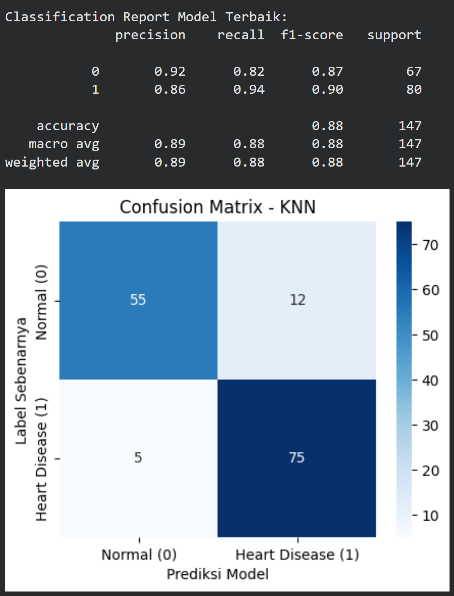
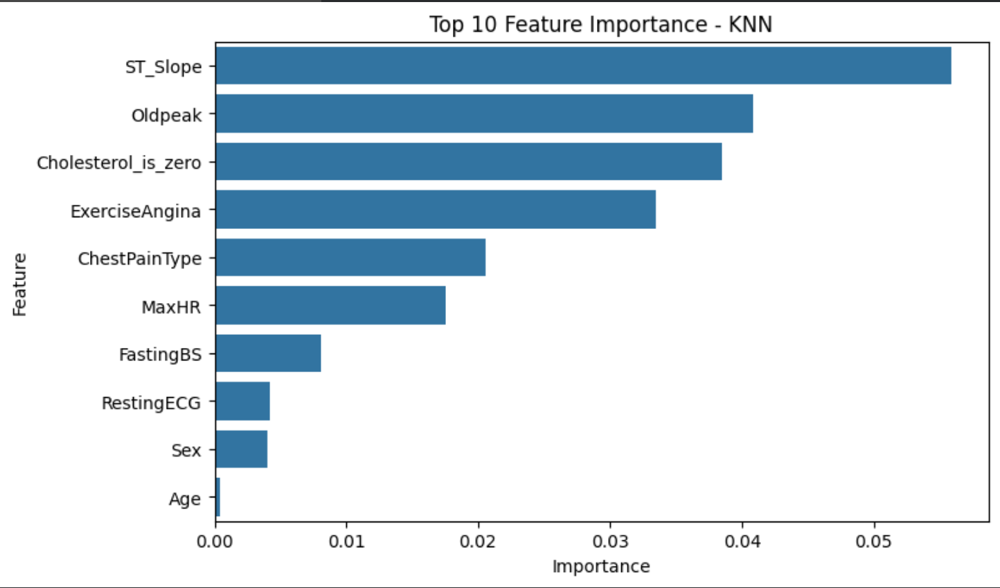

# Heart Disease Risk Analysis and Prediction Using Machine Learning

Project ini merupakan implementasi **Machine Learning** untuk melakukan analisis data klinis pasien dan memprediksi risiko penyakit jantung menggunakan metode **Supervised Classification**.

Project ini mencakup proses end-to-end Machine Learning mulai dari **Data Understanding, Exploratory Data Analysis (EDA), Data Preprocessing, Model Training, Model Evaluation, Feature Importance Analysis, hingga Model Export**.

---

# Project Background

Project ini dikembangkan sebagai bagian dari **POINTER 2026 Machine Learning Workshop**.

Melalui project ini, dilakukan penerapan konsep Machine Learning pada bidang kesehatan untuk menemukan pola dari data klinis pasien dan membangun model klasifikasi yang dapat membantu melakukan screening awal terhadap risiko penyakit jantung.

> Catatan: Model ini dibuat untuk tujuan pembelajaran dan sebagai alat bantu analisis awal berbasis data, bukan sebagai pengganti diagnosis medis.

---

# Project Objectives

Tujuan dari project ini adalah:

- Melakukan analisis terhadap karakteristik data pasien terkait penyakit jantung.
- Melakukan Exploratory Data Analysis (EDA) untuk memahami pola pada dataset.
- Membangun dan membandingkan beberapa Machine Learning Model.
- Mengevaluasi performa model menggunakan beberapa metrik evaluasi.
- Menentukan model terbaik berdasarkan hasil pengujian.
- Mengidentifikasi Feature yang paling berpengaruh terhadap hasil prediksi.
- Menyimpan model akhir agar dapat digunakan kembali.

---

# Dataset

Dataset yang digunakan berisi data klinis pasien dengan beberapa atribut kesehatan yang digunakan untuk melakukan klasifikasi risiko penyakit jantung.

## Dataset Files

| File | Deskripsi |
|---|---|
| train.csv | Dataset utama untuk proses training dan evaluasi model |
| test.csv | Dataset untuk melakukan prediksi |
| sample_submission.csv | Format contoh hasil prediksi |

## Target Variable

Target pada project ini adalah:

`HeartDisease`

| Nilai | Keterangan |
|---|---|
| 0 | Tidak terindikasi penyakit jantung |
| 1 | Terindikasi penyakit jantung |

---

# Feature Dataset

Feature yang digunakan dalam proses modeling:

| Feature | Deskripsi |
|---|---|
| Age | Usia pasien |
| Sex | Jenis kelamin pasien |
| ChestPainType | Jenis nyeri dada |
| RestingBP | Tekanan darah saat istirahat |
| Cholesterol | Kadar kolesterol |
| FastingBS | Indikator gula darah puasa |
| RestingECG | Hasil pemeriksaan ECG |
| MaxHR | Detak jantung maksimum |
| ExerciseAngina | Angina akibat aktivitas fisik |
| Oldpeak | Nilai depresi ST |
| ST_Slope | Kemiringan segmen ST |

---

# Tools & Technologies

## Programming Language

- Python

## Libraries

- Pandas
- NumPy
- Scikit-learn
- Matplotlib
- Seaborn
- Joblib

## Environment

- Google Colab
- Jupyter Notebook
- GitHub

---

# Machine Learning Workflow

Tahapan yang dilakukan dalam project ini:

```
Data Loading
      ↓
Data Understanding
      ↓
Exploratory Data Analysis (EDA)
      ↓
Data Preprocessing
      ↓
Feature Engineering
      ↓
Model Training
      ↓
Model Comparison
      ↓
Model Evaluation
      ↓
Feature Importance Analysis
      ↓
Final Model Training
      ↓
Model Export
```

---

# Exploratory Data Analysis (EDA)

Tahap EDA dilakukan untuk memahami distribusi data, pola, dan hubungan antar Feature.

## Target Distribution



Visualisasi ini menunjukkan distribusi data berdasarkan kategori HeartDisease.

---

## Age Distribution



Analisis distribusi usia digunakan untuk melihat persebaran usia pasien pada dataset.

---

## Correlation Analysis



Correlation Heatmap digunakan untuk melihat hubungan antar Feature numerik dengan target variable.

---

# Machine Learning Model

Beberapa algoritma Machine Learning dibandingkan untuk mendapatkan model dengan performa terbaik.

Model yang diuji:

| Model |
|---|
| Logistic Regression |
| Support Vector Classifier (SVC) |
| K-Nearest Neighbor (KNN) |
| Decision Tree |
| Random Forest |
| Gradient Boosting |
| AdaBoost |

---

# Hyperparameter Configuration

Beberapa konfigurasi Hyperparameter utama yang digunakan:

| Model | Hyperparameter |
|---|---|
| KNN | n_neighbors = 15 |
| Logistic Regression | max_iter = 2000, class_weight = balanced |
| SVC | C = 2, kernel = rbf, class_weight = balanced |
| Decision Tree | max_depth = 4, class_weight = balanced |
| Random Forest | n_estimators = 300, max_features = sqrt |

---

# Model Performance Evaluation

Evaluasi model dilakukan menggunakan:

- Accuracy
- Precision
- Recall
- F1-Score
- Confusion Matrix

Hasil perbandingan model:

| Model | Accuracy | F1 Macro |
|---|---:|---:|
| KNN | 88.44% | 88.22% |
| Logistic Regression | 87.07% | 86.92% |
| Gradient Boosting | 87.07% | 86.88% |
| SVC | 86.39% | 86.32% |
| Random Forest | 86.39% | 86.21% |
| AdaBoost | 85.71% | 85.54% |
| Decision Tree | 82.31% | 82.13% |



---

# Best Model

Berdasarkan hasil evaluasi, model terbaik yang diperoleh adalah:

## K-Nearest Neighbor (KNN)

Performa model:

- Accuracy: **88.44%**
- F1 Macro Score: **88.22%**

Model final kemudian dilatih menggunakan seluruh data training dan disimpan sebagai Machine Learning Pipeline.

---

# Confusion Matrix



Confusion Matrix digunakan untuk melihat kemampuan model dalam melakukan klasifikasi antara pasien dengan dan tanpa indikasi penyakit jantung.

---

# Feature Importance Analysis

Feature Importance Analysis dilakukan untuk mengetahui Feature yang paling berpengaruh terhadap hasil prediksi model.

Feature dengan kontribusi terbesar:

1. ST_Slope
2. Oldpeak
3. Cholesterol_is_zero
4. ExerciseAngina
5. ChestPainType
6. MaxHR



Berdasarkan hasil analisis, Feature yang berkaitan dengan kondisi ECG, aktivitas fisik, dan karakteristik nyeri dada memiliki pengaruh besar terhadap prediksi model.

---

# Final Model Export

Model terbaik disimpan menggunakan Joblib dalam bentuk Machine Learning Pipeline.

Isi pipeline:

- Data preprocessing
- Feature transformation
- KNN Classification Model

File model:

```
models/
└── knn_heart_disease_model.pkl
```

---

# Repository Structure

```
heart-disease-risk-analysis-and-prediction/

├── dataset/
│   ├── train.csv
│   ├── test.csv
│   └── sample_submission.csv
│
├── images/
│   ├── target_distribution.png
│   ├── age_distribution.png
│   ├── correlation_heatmap.png
│   ├── model_comparison.png
│   ├── confusion_matrix.png
│   └── feature_importance.png
│
├── models/
│   └── knn_heart_disease_model.pkl
│
├── notebook/
│   └── Heart_Disease_Prediction_Analysis.ipynb
│
├── reports/
│   └── Heart_Disease_Project_Report.pdf
│
└── README.md
```

---

# How to Run

Clone repository:

```bash
git clone https://github.com/glennronaldo93/heart-disease-risk-analysis-and-prediction.git
```

Install library:

```bash
pip install pandas numpy scikit-learn matplotlib seaborn joblib
```

Jalankan notebook:

```
notebook/Heart_Disease_Prediction_Analysis.ipynb
```

---

# Conclusion

Project ini menunjukkan penerapan workflow Machine Learning secara menyeluruh untuk melakukan prediksi risiko penyakit jantung berdasarkan data klinis pasien.

Melalui proses EDA, perbandingan beberapa algoritma, evaluasi performa, dan Feature Importance Analysis, diperoleh **K-Nearest Neighbor (KNN)** sebagai model terbaik dengan Accuracy sebesar **88.44%** dan F1 Macro Score sebesar **88.22%**.

Project ini juga memberikan insight mengenai Feature yang memiliki kontribusi penting terhadap hasil prediksi model.

---

# Author

**Glenn Ronaldo Tambunan**

D3 Sistem Informasi Student at **Universitas Pembangunan Nasional "Veteran" Jakarta**.

Interested in **Data Analysis, Machine Learning, Data Visualization, and Data-driven Problem Solving**.

This project was developed as part of the **POINTER 2026 Machine Learning Workshop**.